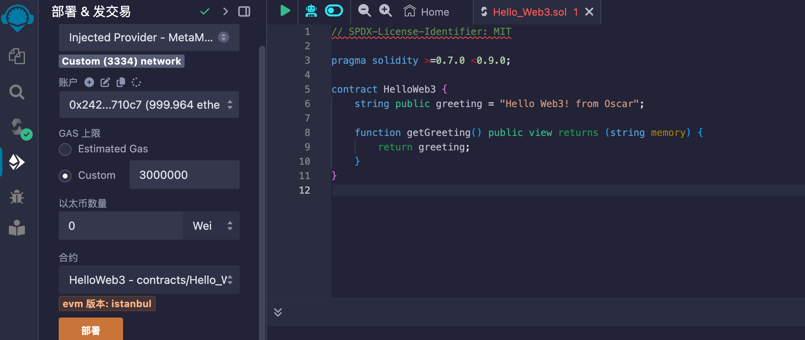
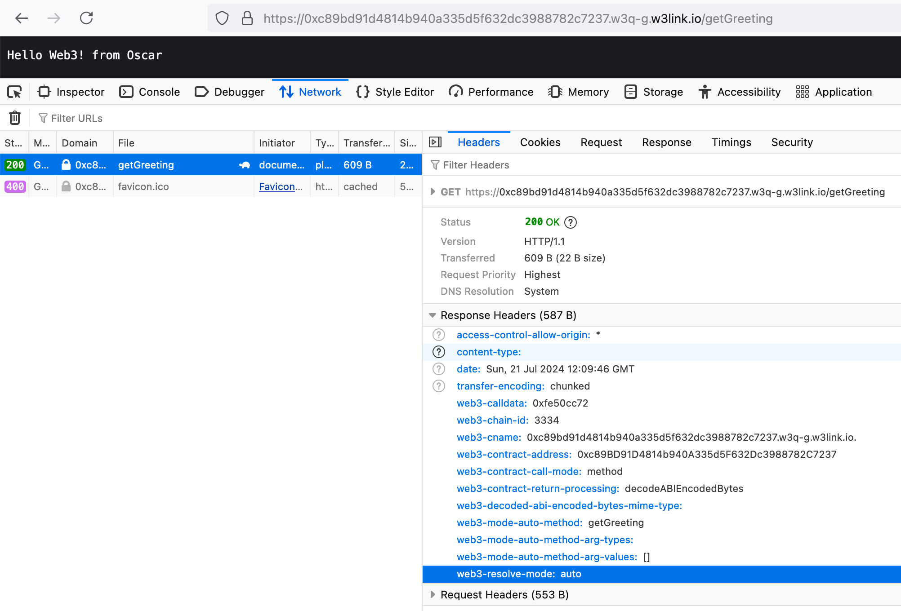

# Web3 URL 残酷共学第 1 期残酷指引

> ⚠️ 正式开始前请确保你在身体上和精神上都处于合适的状态，请刻意练习，残酷面对 🆒。为方便检索 The First Web3 URL Intensive CoLearning 简写为 WICL1st，第 2 期即为WICL2nd，第 3 期即为 WICL3rd，以此类推。

> ⚠️ 报名需要按要求认真填写下面 [ XXX ] 部分，方可通过报名审核，通过审核即可开始自主学习。

---

# [ 你的名字 ]

1. **自我介绍：**

   Jacqueese：
   之前研究方向做人工智能AI相关深度学习方向,研究方向为时空序列预测。但是工作找的是Web前端工程师，也会向全栈方向靠。
   主要想了解 Web3 相关的开发，区块链相关技术。

2. **组队期待：**

   感兴趣一起组队的可以拉我一个

3. **你认为你会完成本次 Web3 URL 的残酷学习吗？**

   Yes 100%


---

## 第 1 期共学时间计划

- **7 月 8 日 - 7 月 14 日**：

  - 自我介绍：大家按要求更新上方自我介绍，方面大家互相了解，及后续自由组队方向。

  -  [Web3 URL 残酷共学频道](https://t.me/LXDAO/8748)报道：大家可以自由在残酷共学群里交流分享，互动答疑，根据自身学习阶段情况随时开启自由组队。

  - 课前学习：了解残酷共学流程，GitHub 协作共学基础；Web3:// 协议课前学习。

- **7 月 15 日 - 7 月 21 日**：

  - **7 月 15 日 周一晚 8 点- 9 点（北京时间）：** 第 1 次公开课分享
  - **本周共学内容：** 涉及 Web3://  的背景和演进历史；支持 Web3://  协议的访问方式 (gateway 和 EVM browser)来浏览以太坊上面的数据；熟悉使用 Web3://  和 EthStorage 早期测试网来部署简单的去中心化网站。
  - **Homework1：** 见[课程 PPT](https://docs.google.com/presentation/d/1egJUKJrjC9wjkmOF9sLBkTSwHpd6hl8FXkWehPW7kFk/edit#slide=id.g1754f50a55c_0_11)。

- **7 月 22 日 - 7 月 28 日**
  - **7 月 22 日 周一晚 8 点- 9 点（北京时间）：** 第 2 次公开课分享

  - **本周共学内容：** 涉及 Web3://  高级开发工具，包括：在命令行通过 web3curl 来通过 Web3://  协议下载数据，通过 ethfs-uploader 批量上传网页数据，通过 manual 模式来搭建去中心化多人交互全链网站；及深入理解以太坊的存储模型和 gas 开销等。
  - **边学边用实战开发：** 根据组队情况自由安排。
  - **Homework2：** 见[课程 PPT](https://docs.google.com/presentation/d/1egJUKJrjC9wjkmOF9sLBkTSwHpd6hl8FXkWehPW7kFk/edit#slide=id.g1754f50a55c_0_11)。

- **7 月 29 日 - 8 月 4 日**
  - **7 月 29 日 周一晚 8 点- 9 点（北京时间）：** 第 3 次公开课分享
  - **本周共学内容：** 涉及实际应用案例分享及未来以太坊基础设施在 Web3://  的重要作用及开发方向等。
  - **边学边用实战开发：** 根据组队情况自由安排。
  - **结营分享：** 具体时间及详情另在「Web3 URL 残酷共学频道」通知。

---

## 笔记证明 Notes Proof
<!-- Content_START --> 
### 07.15

举例示范：

- 今日学习时间：2h
- 学习内容小结：web3协议相关
- Homework 部分（如果有安排需要填写证明完成）
- Question and Ideas（有什么疑问/或者想法，可以记在这里，也可以分享到共学频道群讨论交流）


### 07.16

完成了hw1

# hw1:

## 使用 ethfs-uploader 上传文件/文件夹
步骤 1: 安装 ethfs-uploader
你可以通过以下命令安装 ethfs-uploader：

```
npm i ethfs-uploader
```
ethfs-uploader 的 npm 页面可以在这里找到。

步骤 2: 创建 FlatDirectory 合约
使用私钥 0x112233... 在默认链（Galileo Testnet）上创建 FlatDirectory。

```
npx ethfs-uploader --create --privateKey 0x112233...
```
如果在其他支持 EVM 的链上创建 FlatDirectory，则需要添加 chainId，例如 Goerli。

```
npx ethfs-uploader --create --privateKey 0x112233... --chainId 5
```
还可以指定链的 RPC URL。

```
npx ethfs-uploader --create --privateKey 0x112233... --chainId 5 --RPC https://...
```
交易确认后，将获得一个 FlatDirectory 地址，例如 0x37DF32c7a3c30D352453dadACc838461d8629016。

步骤 3: 上传文件
在这一部分，将把文件夹上传到刚刚创建的 FlatDirectory 中。

为了识别 FlatDirectory 合约所在的链，需要在合约地址前添加链的短名称。详细信息请参见 EIP-3770 地址。

短名称:地址

例如，创建的地址在 Galileo 网络上是：

```
w3q-g:0x37DF32c7a3c30D352453dadACc838461d8629016
```
运行命令来上传文件。

```
npx ethfs-uploader <directory|file> <address> --privateKey <private-key>
将 "dist" 文件夹的内容上传到地址 0x37DF32c7a3c30D352453dadACc838461d8629016 的命令是：
```
```
npx ethfs-uploader /Users/.../dist w3q-g:0x37DF32c7a3c30D352453dadACc838461d8629016 --privateKey 0x112233...
```

步骤 4: 设置默认文件
还可以使用 default 命令设置 FlatDirectory 的默认文件。

运行命令来设置默认文件。

```
npx ethfs-uploader --default --address <address> --file <name> --privateKey <private-key>
```
将默认文件 "hello.txt" 设置为 "0x37DF32c7a3c30D352453dadACc838461d8629016" 的命令是：

```
npx ethfs-uploader --default w3q-g:0x37DF32c7a3c30D352453dadACc838461d8629016 --file hello.txt --privateKey 0x112233...
```
步骤 5: 浏览的文件！
现在，应该能够通过以下链接浏览刚刚上传的文件：

https://${address}.w3q-g.w3link.io/${filename}

我们两个文件的访问地址是：

https://0x37df32c7a3c30d352453dadacc838461d8629016.w3q-g.w3link.io/hello.txt

https://0x37df32c7a3c30d352453dadacc838461d8629016.w3q-g.w3link.io/img/1.jpeg

因为默认文件已经设置为 "hello.txt"，所以可以通过以下链接访问它。

https://0x37df32c7a3c30d352453dadacc838461d8629016.w3q-g.w3link.io/

步骤 6: 使用 js 代码读取和写入 FlatDirectory
获取 FlatDirectory 合约的 ABI。

```
const flatDirectoryAbi = [
  "function write(bytes memory name, bytes memory data) external payable",
  "function read(bytes memory name) external view returns (bytes memory, bool)",
  "function writeChunk(bytes memory name, uint256 chunkId, bytes memory data) external payable",
  "function readChunk(bytes memory name, uint256 chunkId) external view returns (bytes memory, bool)"
];
```
使用 ethers 创建合约对象。

```
export const FlatDirectoryContract = (address) => {
    const provider = new ethers.providers.Web3Provider(window.ethereum);
    const contract = new ethers.Contract(address, flatDirectoryAbi, provider);
    return contract.connect(provider.getSigner());
};
```
读取文件

```
const contract = FlatDirectoryContract('0x37DF32c7a3c30D352453dadACc838461d8629016');
const hexName = '0x' + Buffer.from('hello.txt', 'utf8').toString('hex');
const content = contract.read(hexName);
console.log(content);
```
写入文件

```
const filePath = '';
let fileSize = ;
const hexName = '0x' + Buffer.from('img/1.jpeg', 'utf8').toString('hex');
const contract = FlatDirectoryContract('0x37DF32c7a3c30D352453dadACc838461d8629016');
const content = fs.readFileSync(filePath);

// 如果文件大于 475K，需要分块
let chunks = [];
if (fileSize > 475 * 1024) {
  const chunkSize = Math.ceil(fileSize / (475 * 1024));
  chunks = bufferChunk(content, chunkSize);
  fileSize = fileSize / chunkSize;
} else {
  chunks.push(content);
}
// 大于 24K 的文件需要额外的 staking 代币
let cost = 0;
if (fileSize > 24 * 1024 - 326) {
  cost = Math.floor((fileSize + 326) / 1024 / 24);
}

for (const index in chunks) {
  const chunk = chunks[index];
  const hexData = '0x' + chunk.toString('hex');

  const estimatedGas = await contract.estimateGas.writeChunk(hexName, index, hexData, {
    value: ethers.utils.parseEther(cost.toString())
  });
  // 上传文件
  const option = {
    gasLimit: estimatedGas.mul(6).div(5).toString(),
    value: ethers.utils.parseEther(cost.toString())
  };
  const tx = await fileContract.writeChunk(hexName, index, hexData, option);
  console.log(`Transaction Id: ${tx.hash}`);
  
  // 获取结果
  const receipt = await tx.wait();
  if (receipt.status) {
    console.log(`文件 ${fileName} chunkId: ${index} 已上传！`);
  }
}
```


### 07.17
在 Manual mode 中，路径信息会传入合约的 `fallback(bytes)` 方法，从而允许合约使用自定义的方式处理请求。这种模式和 web2 的 url 路由是一致的。

### 07.18

- 今日学习时间：1 h
- 学习内容小结：完成 Homework 的前两项
- Homework 部分

1. 查询 `0x08ba8cbbefa64aaf9df25e57fe3f15ecc277af74` id 为 46 的 NFT 的所有者，调用其 ownerOf 方法即可，参数为 tokenId=46。Web3 url 为

   ```
   web3://0x08BA8CBbefa64Aaf9DF25e57fE3f15eCC277Af74/ownerOf/46?returns=(address)
   ```

   返回结果为

   ```
   ["0xEf0b29B14C735505D181eaa613909345A964927D"]
   ```

2. 查询 Bitget 地址 `0x1AB4973a48dc892Cd9971ECE8e01DcC7688f8F23 `的 USDT 持有量，调用其 balanceOf 函数即可，参数为 who=0x1AB4973a48dc892Cd9971ECE8e01DcC7688f8F23。Web3 url 为

   ```
   web3://0xdac17f958d2ee523a2206206994597c13d831ec7/balanceOf/0x1AB4973a48dc892Cd9971ECE8e01DcC7688f8F23?returns=(uint256)
   ```

   返回结果为
   
   ```
   ["0x1210389c1388"]
   ```
   ### 07.18

- https://web3url.io/#/

  - https://cyberbrokers-meta.w3eth.io/renderBroker/5
  - manual mode 和 auto mode 有什么区别？https://docs.web3url.io/web3-url-structure/resolve-mode/mode-auto

    - https://0x4e1f41613c9084fdb9e34e11fae9412427480e56.w3eth.io/tokenSVG/9352?mime.type=svg 通过 ?mime.type 可以指定 content type 来渲染
    - manual 模式是通过合约里面返回相应的信息来判断的
    - 技术实现是使用 fallback 方法进行 url 解析，返回的数据必须是 abi.encoded bytes

    ```
    fallback(bytes calldata cdata) external returns (bytes memory) {
        if(cdata.length == 0 || cdata[0] != 0x2f) {
            return bytes("");
        }

        // Frontpage call
        if (cdata.length == 1) {
          return bytes(abi.encode(indexHTML(1)));
        }
        // /index/[uint]
        else if(cdata.length >= 6 && ToString.compare(string(cdata[1:6]), "index")) {
            uint page = 1;
            if(cdata.length >= 8) {
                page = ToString.stringToUint(string(cdata[7:]));
            }
            if(page == 0) {
                return abi.encode("Not found");
            }
            return abi.encode(indexHTML(page));
        }

        // Default
        return abi.encode("Not found");
    }
    ```

    - manual 默认返回的信息头格式是 Content-type: text/html，如果有后缀，则使用相应的 mime
    - TODO 这样的话，解析和渲染流程也需要行程标准，让 Native 浏览器进行实现？目前这些逻辑实际上在 gateway 层面
    -

-

TODO：

- 找到相应的合约看看代码实现
- 查看对应的 ERC 原文
  - https://eip.fun/eips/eip-4804
  - https://eip.fun/eips/eip-6860
- 查看官网 https://web3url.io/
- 原生支持的浏览器实现 https://github.com/web3-protocol/evm-browser
- 第一节课 https://youtu.be/hmN77o-ex8I
- 查看 https://github.com/ethstorage/awesome-web3
- EthStorage 是怎么扩容以太坊的，通过很低的 costs
- ERC5018: Filesystem-Like Interface https://eips.ethereum.org/EIPS/eip-5018 ethfs-uploader to synchronize folder/files https://www.npmjs.com/package/ethfs-uploader
- ERC5219, ERC6944: Contract Resource Requests Customized headers / error code for ERC4804
- ERC6821: ENS => Address Mapping Standard
- Homework 1
  - Find the ownership of an your favor NFT
  - Find the balance of an account in an ERC-20 contract (USDC / USDT)
  - Deploy a contract in auto model and say “hello world”
  - Deploy a contract in manual model and say “hello world”
- 可以开发一个一键上传或者创建 Web3 站点的合约？

### 07.19
- 今日学习时间：1h
- 学习内容小结：阅读docs.web3url.io
- [Part 2.1 - Basic structure 阅读笔记](https://www.notion.so/Day-7-19-800cc3a737ea49d588a34ee549971a51?pvs=4)
- Homework 部分（如果有安排需要填写证明完成）
- Question and Ideas（有什么疑问/或者想法，可以记在这里，也可以分享到共学频道群讨论交流）
   - 稍微查看了以下同学的笔记，感觉自己的基础太薄，需要学很久去补一些概念
- TODO
   - 明天继续阅读这个docs文档

### 07.20

- 今日学习时间：0.5 hour
- 学习内容小结：
  - Read codebase https://github.com/web3-protocol/web3protocol-js
  - Read codebase https://github.com/web3-protocol/web3curl-js

  ### 07.21

- 今日学习时间：60 min
- 学习内容小结：学习EthStorage[笔记](https://pinto-zinnia-ba1.notion.site/EthStorage-5c9b378b51ae4c8aa8ebbc6f18be02d5?pvs=25)
### 07.22

- 今日学习时间：1 小时

- 学习内容小结：

  - 学习用 [Solidity](https://soliditylang.org/) 简单编写合约，简单使用 [Remix IDE](http://remix.ethereum.org/) 部署合约。

- Homework 

  - 完成作业 3 ：Deploy a contract in auto mode and say "hello world"

    -  auto mode：The smart contract is generic and has not implemented a interface defined by the `web3://` protocol. In this case, we will craft the URL path in a specific way to indicate the name, arguments and return signature of the method we want to call on the contract.

      直接写方法即可，不用单独 Declare a smart contract as manual mode 。🤔

    ```solidity
    // SPDX-License-Identifier: MIT
    
    pragma solidity >=0.7.0 <0.9.0;
    contract HelloWeb3 {
        string public greeting = "Hello Web3! from Oscar";
        function getGreeting() public view returns (string memory) {
            return greeting;
        }
    }
    ```

  - 领取 W3Q 测试币：部署合约成功，[合约地址详情](https://explorer.galileo.web3q.io/tx/0x0c28db6ee94d92b82f9d7075e2bcfa562541e3af479ccf07802867bf0176e70f/internal-transactions)：0xc89bd91d4814b940a335d5f632dc3988782c7237

    
    
    ⚠️Galileo Testnet W3Q 的链 id 为3334，访问时需要指定``:3334``，auto mode 模式需要 指定``/getGreeting`` ，不然访问会失败。🤔
    
    ``web3://0xc89bd91d4814b940a335d5f632dc3988782c7237:3334/getGreeting``
    
    具体见下图：
    
    


### 07.23
- 今日学习时间：20:30-21:00
- 学习内容小结：观看了freeCodeCamp出品的[30分钟区块链基础课程](https://www.youtube.com/watch?v=gyMwXuJrbJQ)（剩余28.5小时🫡）
- Question and Ideas

<!-- Content_END -->
