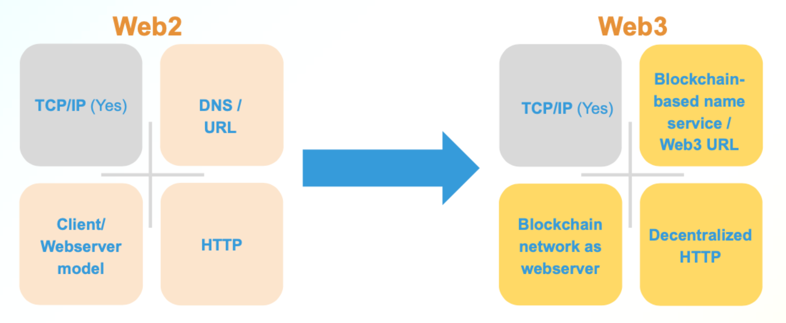
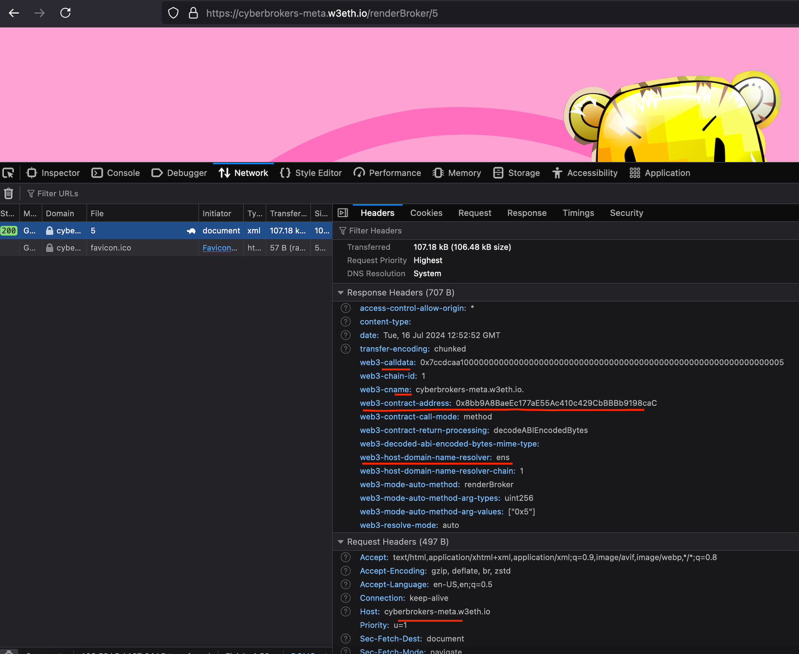
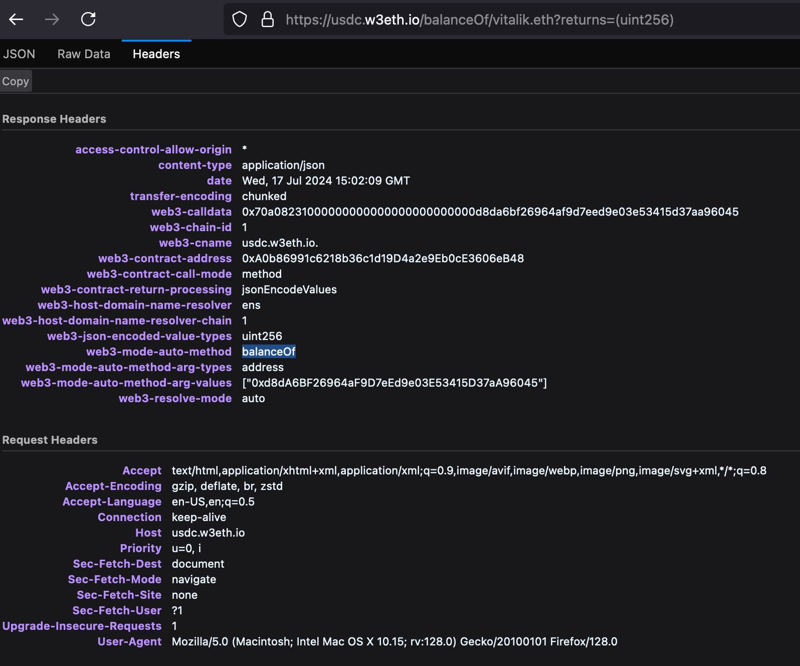
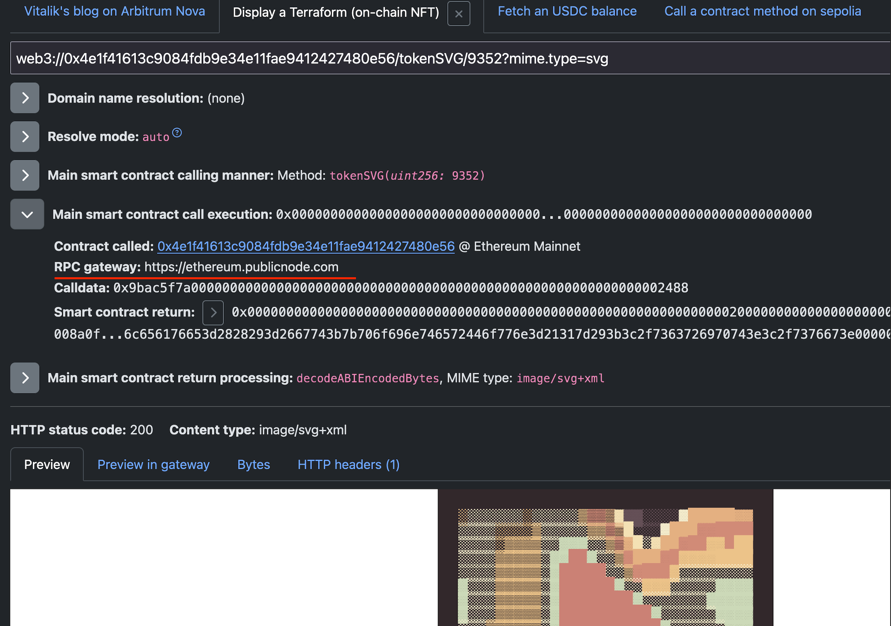
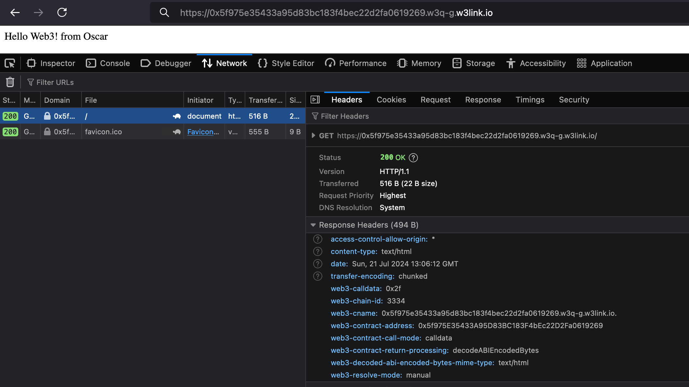
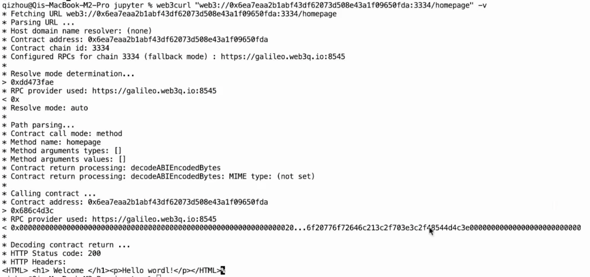

# Web3 URL 残酷共学第 1 期残酷指引

> ⚠️ 正式开始前请确保你在身体上和精神上都处于合适的状态，请刻意练习，残酷面对 🆒。为方便检索 The First Web3 URL Intensive CoLearning 简写为 WICL1st，第 2 期即为WICL2nd，第 3 期即为 WICL3rd，以此类推。

> ⚠️ 报名需要按要求认真填写下面 [ XXX ] 部分，方可通过报名审核，通过审核即可开始自主学习。

---

# [ Oscar ]

1. **自我介绍：**
   Oscar，a eco-lifelong learner，懂点技术的产品或运营角色。
   - 非常喜欢以开源的方式残酷共学，和更多的 LXer 学习交流。
   - 之前有深入学习过 Nostr 协议，想认真学一下以太坊里的 Web3:// 协议，了解协议背后设计的思路，及基于协议如何更好构建围绕 EVM 具体的生活 dApps。
   
2. **组队期待：**
   预计参与：产品设计，写 PRD ，配合 coding，具体 idea 还在构建中，和聊的来的小伙伴看看做一个有意思的基于 Web3:// 的实用项目，Just do it。
   
3. **你认为你会完成本次 Web3 URL 的残酷学习吗？**
   100%

---

## 第 1 期共学时间计划

- **7 月 8 日 - 7 月 14 日**：

  - 自我介绍：大家按要求更新上方自我介绍，方面大家互相了解，及后续自由组队方向。
  -  [Web3 URL 残酷共学频道](https://t.me/LXDAO/8748)报道：大家可以自由在残酷共学群里交流分享，互动答疑，根据自身学习阶段情况随时开启自由组队。
  - 课前学习：了解残酷共学流程，GitHub 协作共学基础；Web3:// 协议课前学习。

- **7 月 15 日 - 7 月 21 日**：

  - **7 月 15 日 周一晚 8 点- 9 点（北京时间）：** 第 1 次公开课分享
  - **本周共学内容：** 涉及 Web3://  的背景和演进历史；支持 Web3://  协议的访问方式 (gateway 和 EVM browser)来浏览以太坊上面的数据；熟悉使用 Web3://  和 EthStorage 早期测试网来部署简单的去中心化网站。
  - **Homework1：** 见[课程 PPT](https://docs.google.com/presentation/d/1egJUKJrjC9wjkmOF9sLBkTSwHpd6hl8FXkWehPW7kFk/edit#slide=id.g1754f50a55c_0_11)。

- **7 月 22 日 - 7 月 28 日**
  - **7 月 22 日 周一晚 8 点- 9 点（北京时间）：** 第 2 次公开课分享
  - **本周共学内容：** 涉及 Web3://  高级开发工具，包括：在命令行通过 web3curl 来通过 Web3://  协议下载数据，通过 ethfs-uploader 批量上传网页数据，通过 manual 模式来搭建去中心化多人交互全链网站；及深入理解以太坊的存储模型和 gas 开销等。
  - **边学边用实战开发：** 根据组队情况自由安排。
  - **Homework2：** 见[课程 PPT](https://docs.google.com/presentation/d/1egJUKJrjC9wjkmOF9sLBkTSwHpd6hl8FXkWehPW7kFk/edit#slide=id.g1754f50a55c_0_11)。

- **7 月 29 日 - 8 月 4 日**
  - **7 月 29 日 周一晚 8 点- 9 点（北京时间）：** 第 3 次公开课分享
  - **本周共学内容：** 涉及实际应用案例分享及未来以太坊基础设施在 Web3://  的重要作用及开发方向等。
  - **边学边用实战开发：** 根据组队情况自由安排。
  - **结营分享：** 具体时间及详情另在「Web3 URL 残酷共学频道」通知。

---

## 笔记证明 Notes Proof

<!-- Content_START --> 

### 07.15
- 今日学习时间：2 小时
- 学习内容小结：
  - Web3://  的[背景和历史](https://docs.web3url.io/vision/background)学习：尽管在协议层面向去中心化转变，但许多去中心化应用（dApps）仍依赖于中心化组件，如服务器或网络服务提供商（NSP）。
  - [解决方案](https://docs.web3url.io/vision/our-solution)旨在取代 Web2 集中化瓶颈：设计思路学习
    
    - 专用的以太坊侧链，支持 EVM 和高效的二进制大对象（BLOB）存储，将取代传统的客户端/服务器模型。
    - 采用 Web3 风格的 URL 标准，替代传统的 DNS/URL 方案。
    - 作为轻客户端的 Web 浏览器扩展，通过 web3 URL 执行 EVM 调用，将成为去中心化的 HTTP 。
  
- 第一次公开课部分
  - 对什么是 "web3://" 访问协议？Why  "web3://“？How to Use web3: //? How to Access EVM with web3:// ？ 有了初步的认识和理解。
  - 目前安装火狐浏览器下载了 [Firefox extension]( https://addons.mozilla.org/en-US/firefox/addon/web3url/) 进行体验，使用 Native browser support 体验，具体背后调用逻辑还待学习。
- Homework 部分 
  - 暂无

- Question and Ideas
  - 在想基于web3:// 哪些应用场景是当前最需要的或频率最高的？

### 07.16

- 今日学习时间：2 小时

- 学习内容小结：
  - 学习了解以太坊改进提案 [EIP-4804](https://eips.ethereum.org/EIPS/eip-4804) 和  [EIP-6860](https://eips.ethereum.org/EIPS/eip-6860)：
    - ERC-4804，也称为“Web3 URL到EVM调用消息转换”，旨在为以太坊网络定义一种新的 URL 类型的标准。
    -  EIP-6860，旨在为以太坊虚拟机（EVM）Base 4804 引入一个去中心化的呈现层。
    
  - 通过访问 `web3://cyberbrokers-meta.eth/renderBroker/5`跳转 https://cyberbrokers-meta.w3eth.io/renderBroker/5 学习了解背后数据是如何被调用及被呈现。
  
    - 根据请求的网络对象位置（如以太坊或其他区块链）将请求分发到不同的 Gateway
  
    - Gateway 通过调用 ENS 把 cyberbrokers 所映射的合约地址来去定位。🤔
  
      
  
  - 回顾 [公开课](https://www.youtube.com/watch?v=hmN77o-ex8I) 学习，尤其是 QA 环节。我们需要一个协议保证「去中心定位去中心化的资源」。一个是如何定位的问题，一个是如何访问的问题。
  
  - 对目前具体的 Application 方向进行了了解，面临一些具体问题：目前很多浏览器不兼容，存储费用过高等。
  
- Homework 部分 
  - 暂无
  
- Question and Ideas
  - 并不是所有的东西都需要去中心化，去中心和中心化如何平衡？

### 07.17

- 今日学习时间：1 小时
- 学习内容小结：
- Homework 部分 完成前 2 个
  - Find the ownership of an your favor NFT
    - 使用Firefox Extension访问：web3://moon-birds-xyz.eth/render/108
      - 跳转到：https://moon-birds-xyz.w3eth.io/render/108
        - web3-chain-id: 1
        - web3-cname: moon-birds-xyz.w3eth.io
        - web3-contract-address：0x56B9308EFd014f10423B42B3aDE7eeCFe128B1BD
          - ENS Name Tag：[web3url.eth](https://etherscan.io/address/0xbff45643d3af697a178ac671212e284a7f86cdae)
          - Contract Source Code (Solidity):  查看 render 方法
  - Find the balance of an account in an ERC-20 contract (USDC / USDT)
    - 使用Firefox Extension访问：web3://usdc.eth/balanceOf/vitalik.eth?returns=(uint256)
      - 跳转到：https://usdc.w3eth.io/balanceOf/vitalik.eth?returns=(uint256)
        - web3-chain-id：1
        - web3-cname：usdc.w3eth.io.
        - web3-contract-address：0xA0b86991c6218b36c1d19D4a2e9Eb0cE3606eB48
        - web3-host-domain-name-resolver：ens
        - web3-mode-auto-method：balanceOf
        - 


- Question and Ideas
  - token-address：`0x52284158e02425290f6b627aeb5fff65edf058ad` 和contract-address：`0x56B9308EFd014f10423B42B3aDE7eeCFe128B1BD` 之间的连接关系🤔

### 07.18

- 今日学习时间：1 小时
- 学习内容小结：
  - [WEB3:// URL STRUCTURE](https://docs.web3url.io/web3-url-structure/base) 协议的框架结构思路学习
    - Base structure
    - Standards
    - Domain name resolution
    - Resolve mode 解析模式定义了在不同环境下如何处理和解释 Web3 URL，以确保资源的正确定位和访问。

```html
node . -v 'web3://w3url.eth'
* Host domain name resolver: ens
*   Resolver address: 0xc0497E381f536Be9ce14B0dD3817cBcAe57d2F62  <!-- ENS解析的以太坊地址 -->
*   Resolver chain id: 1  <!-- 以太坊主网 -->
*   Resolver chain RPC: https://ethereum.publicnode.com <!-- 与以太坊主网交互的RPC端点 ?-->
*   Domain name being resolved: w3url.eth <!-- 解析的ENS域名 -->
*   Resolution type: contentContractTxt <!-- 解析类型 -->
*   contentcontract TXT record: w3q-g:0xEbcA4860ebBe969E9Bc42643fcb437879dBDa9C6
*   Result address: 0xEbcA4860ebBe969E9Bc42643fcb437879dBDa9C6
*   Result chain id: 3334
```

- Homework 

  - Deploy a contract in auto model and say "hello world" 自动模式
  - Deploy a contract in manual model and say "hello world" 手动模式

- Question and Ideas
  - Web3URL Chrome 插件使用研究 
    - https://github.com/Whitehare2023/web3url
    - https://github.com/ComfyGummy/chrome-web3

### 07.19

- 今日学习时间：1 小时

- 学习内容小结：

  - WEB3:// CLIENTS 学习了解

    - 三种方式：HTTPS gateways、EVM Browser、Chrome extension

    - Librairies：web3protocol-go、web3protocol-js

    - 两个 Debug 工具：[Web3:// Sandbox](https://w3-sandbox.eth.eth.w3link.io/) （这个比较直观） + Web3curl （单独安装）

      

  - 补充学习：

    - [IANA - Uniform Resource Identifier (URI) SCHEMES（统一资源标识符方案）](http://www.iana.org/assignments/uri-schemes)

    - URI （Uniform Resource Identifier，统一资源标识符）。URI 属于 URL 更高层次的抽象，一种字符串文本标准。就是说，URI 属于父类，而 URL 属于 URI 的子类。URL 是 URI 的一个子集。二者的区别在于，URI 表示请求服务器的路径，定义这么一个资源。而 URL 同时说明要如何访问这个资源（http://）。
    
      ```http
      ftp://ftp.is.co.za/rfc/rfc1808.txt (URL)
      http://www.ietf.org/rfc/rfc2396.txt (URL)
      ldap://[2001:db8::7]/c=GB?objectClass?one (URL)
      mailto:John.Doe@example.com (URL)
      news:comp.infosystems.www.servers.unix (URL)
      tel:+1-816-555-1212
      telnet://192.0.2.16:80/ (URL)
      urn:oasis:names:specification:docbook:dtd:xml:4.1.2
      ```
    
      ```http
      scheme://host[:port#]/path/.../[;url-params][?query-string][#anchor]
      scheme //有我们很熟悉的 http、https、ftp 以及著名的 ed2k，迅雷的 thunder 等。
      host //HTTP 服务器的IP地址或者域名
      port# //HTTP 服务器的默认端口是 80 (可省略)。如果使用了别的端口必须指明，例如     tomcat 的默认端口是 8080 http://localhost:8080/
      path //访问资源的路径
      url-params //所带参数
      query-string //发送给 http 服务器的数据
      anchor //锚点定位
      ```
    
      

- Homework 无

- Questions and Ideas

  - RPC gateway 是去中心化的吗？🤔

### 07.20

- 今日学习时间：1 小时

- 学习内容小结：

  - 学习用 [Solidity](https://soliditylang.org/) 简单编写合约，简单使用 [Remix IDE](http://remix.ethereum.org/) 部署合约。

- Homework 

  - 完成作业 3 ：Deploy a contract in auto mode and say "hello world"

    -  auto mode：The smart contract is generic and has not implemented a interface defined by the `web3://` protocol. In this case, we will craft the URL path in a specific way to indicate the name, arguments and return signature of the method we want to call on the contract.

      直接写方法即可，不用单独 Declare a smart contract as manual mode 。🤔

    ```solidity
    // SPDX-License-Identifier: MIT
    
    pragma solidity >=0.7.0 <0.9.0;
    contract HelloWeb3 {
        string public greeting = "Hello Web3! from Oscar";
        function getGreeting() public view returns (string memory) {
            return greeting;
        }
    }
    ```

  - 领取 W3Q 测试币：部署合约成功，[合约地址详情](https://explorer.galileo.web3q.io/tx/0x0c28db6ee94d92b82f9d7075e2bcfa562541e3af479ccf07802867bf0176e70f/internal-transactions)：0xc89bd91d4814b940a335d5f632dc3988782c7237

    
    
    ⚠️Galileo Testnet W3Q 的链 id 为3334，访问时需要指定``:3334``，auto mode 模式需要 指定``/getGreeting`` ，不然访问会失败。🤔
    
    ``web3://0xc89bd91d4814b940a335d5f632dc3988782c7237:3334/getGreeting``
    
    具体见下图：
    
    

### 07.21

- 今日学习时间：1 小时
- 学习内容小结：
  - ETHSTORAGE Networks ：了解学习 EthStorage sidechain is fully EVM-compatible, [Galileo Testnet](https://docs.web3url.io/ethstorage-information/networks) 设置。

  - EthStorage POA Explorer：https://explorer.galileo.web3q.io

  - ethereum-magicians.org：[EIP-4804: Web3 URL to EVM Call Message Translation](https://ethereum-magicians.org/t/eip-4804-web3-url-to-evm-call-message-translation/8300)
  
  - **[FlatDirectory](https://docs.web3url.io/advanced-topics/flatdirectory) ：** ERC-5018 提议的 FlatDirectory 是用于文件系统目录的标准接口，允许在基于 EVM 的区块链上的任何二进制对象被其他 dApp 重新使用。该标准允许在智能合约中实现文件系统目录的标准 API。该标准提供了基本功能，可以读取/写入任何大小的二进制对象，并且如果对象过大而无法在单个交易中处理，则允许进行对象的分块读写。
  
- Homework ：Deploy a contract in manual model and say "hello world" 

  - A `manual` resolve mode smart contract is designed for the `web3://` protocol. In this case, any path is valid, and the smart contract will usually returned some content for at least the root path. 

  ```solidity
  // SPDX-License-Identifier: MIT
  
  pragma solidity >=0.7.0 <0.9.0;
  
  contract HelloWeb3 {
      string public greeting = "Hello Web3! from Oscar";
      
      function resolveMode() external pure returns (bytes32) {
          return "manual";
      }
      function getGreeting() public view returns (string memory) {
          return greeting;
          }
      fallback(bytes calldata cdata) external returns (bytes memory) {
      // 检查路径是否为空或不以'/'开头：
          if (cdata.length == 0 || cdata[0] != 0x2f) {
              return bytes("");
          }
          // 仅包含 '/'
          if (cdata.length == 1) {
              return abi.encode(getGreeting());
          }
          return abi.encode("Not found");
      }
  }
  ```

  部署合约成功，[合约地址详情](https://explorer.galileo.web3q.io/tx/0x340be88ad1b319d9310c76d25ce1ec1bdf5b91e5be8b7a93e21d41b34145d28a/internal-transactions)：0x5f975e35433a95d83bc183f4bec22d2fa0619269

  ⚠️Galileo Testnet W3Q 的链 id 为3334，访问时需要指定``:3334``，在 manual mode 模式`` any path is valid`` 🤔。
  直接访问``web3://0x5f975e35433a95d83bc183f4bec22d2fa0619269:3334`` 正常。
  


### 07.22
- 今日学习时间：2 小时
- 学习内容小结：
  - [第二节公开课](https://www.youtube.com/watch?v=z207TQYNSdM)学习，后续看回放在具体实操
    
  - 基于 Web3:// 应用场景思考
    - Sample Applications 参考
      - Tutorial: https://tutorial.w3q.w3q-g.w3link.io/
      - W3NS: https://w3ns.w3q.w3q-g.w3link.io/
      - Blog platform: https://dblog.w3q.w3q-g.w3link.io/
      - W3Box: https://w3box.w3q.w3q-g.w3link.io/
      - W3Drive: https://w3drive.w3q.w3q-g.w3link.io/
      - W3Mail: https://w3mail.w3q.w3q-g.w3link.io/
      - QRobot: https://qrobot.w3q.w3q-g.w3link.io/
  
    - 天涯论坛、维基百科、GitHub、个人博客
    - 好玩的一个 Web3 网页🤔
    - 与 Nostr 网络结合 
  

### 07.23

- 今日学习时间：1 小时
- 学习内容小结：
  - 去中心化存储应用及 gas 开销了解
    - 下载的命令行工具 [web3curl](https://docs.web3url.io/web3-clients/web3curl) 通过 Web3://  协议下载数据了解学习
    - 批量上传工具 [ethfs-uploader](https://docs.web3url.io/tutorials-on-ethstorage-early-testnet/upload-your-first-file-folder-with-ethfs-uploader) 批量上传网页数据 了解学习
    - https://github.com/ethstorage/evm-large-storage/blob/master/contracts/examples/FlatDirectory.sol  待学习

  - Manual 模式搭建网站了解学习：

    -  https://github.com/ethstorage/web3url-website 为例学习去中心化全链网站，前端页面如何从合约渲染出来。


### 07.24

- 今日学习时间：1 小时
- 学习内容小结：
  - 去中心化留言墙 demo 熟悉
    - 合约[部署](https://explorer.galileo.web3q.io/tx/0x51c9d279e82b3e62e75a0aad357492b242882179a95c440089847e988b6fbe20/internal-transactions)：``0x236993aa25b16e2cadd73f64350a38d310bce596``
    - 合约访问：
      - auto 模式，gateway 方式查看：
        - ``web3://0x236993aa25b16e2cadd73f64350a38d310bce596:3334/homepage``
      - manual 模式：适合更复杂的交互
    - 合约交互：addPost()方法
    - 合约升级：比如新增“增删改查”功能，需要在升级模式对合约进行升级
      - 测试很重要：不然很耗 Gas 

    ```solidity
    // SPDX-License-Identifier: GPL-3.0
    
    pragma solidity >=0.8.2 <0.9.0;
    
    contract Wall{
        string[] posts;
        function addPost(string memory post) public {
            posts.push(post);
        }
        function getPosts() public view returns(string[] memory){
            return posts;
        }
    
        function homepage() public view returns(string memory){
            string memory page = "<HTML><h1> Welcome </h1>";
            
            for (uint256 i = 0; i < posts.length; i++) {
                page = string.concat(page, "<p>");
                page = string.concat(page, posts[i]);
                page = string.concat(page, "</p>");
            }
            page = string.concat(page, "</HTML>");
            return page;
        }
    }
    
    ```

    - web3curl 测试：结构熟悉

      

  - [ethfs-cli](https://github.com/ethstorage/ethfs-cli) 了解学习

    - 通过智能合约实现批量上传文件到以太坊存储
    - 修改了以太坊存储逻辑，激励机制
    - [FlatDirectory](https://docs.web3url.io/advanced-topics/flatdirectory) 路由实现了解
    - 架设自己网关？ 待学习


<!-- Content_END -->
