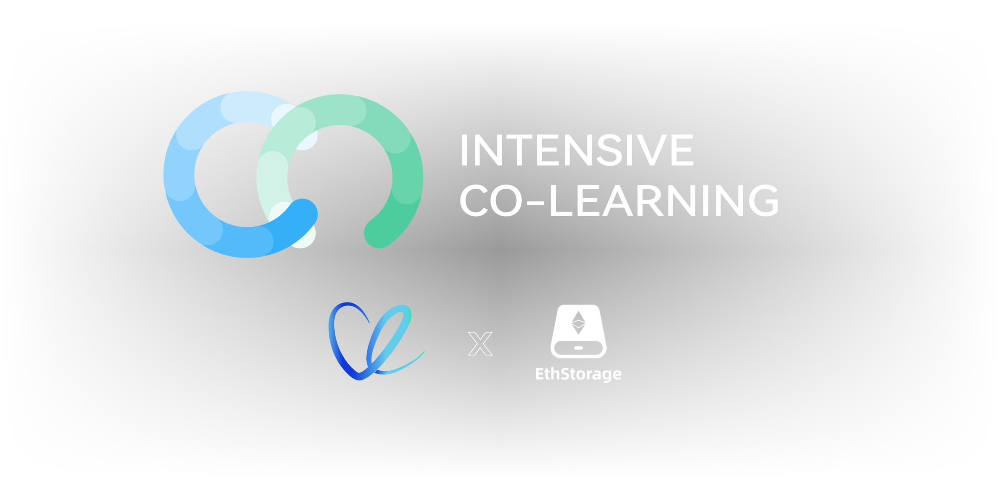

# Web3 URL 残酷共学 by LXDAO & ETHStorage 

>web3:// - Access Protocol for Future Web3. 

## 什么是「残酷共学」（Intensive CoLearning）？

残酷共学是由 [Bruce Xu](https://twitter.com/brucexu_eth) 首创的一种学习模式，目前由 [LXDAO](https://lxdao.io/) 组织并运营残酷共学品牌。共学有很多种，「残酷共学」与之不同的是「残酷」：

- 你必须每天围绕某个「共学主题」进行学习，每周只有**两次**请假机会，通常每天至少需要花费半个小时（最好一个小时）来学习。
- 你必须提交你的学习证明（按照共学课程或任务）到这个「仓库」来证明你今天学习了。
- 如果你没有完成上面两点，你会立刻被踢掉并且标记为 ❌ 失败。
- 每期残酷共学以 4 周为一个周期，第一周为共学启动报名和熟悉共学规则，第二周到第四周将正式启动共学（为期 21 天），中途不得加入。
- 共学方向包括不限于：英语、区块链、以太坊、Web3 技术、DAO、加密思潮等，自由自主发起。内容包括不限于：视频、书籍、文章、课程、实战。

报名方式是完全基于 **GitHub** 的流程，通过提交 **PR** 进行申请，合并 PR 之后拥有更新权限，更新到自己的 Markdown 笔记下面。如果你不熟悉 GitHub 和 Git 的操作，请先自行学习。通常还会有一个小型的 TG 交流群方便交流。

关于更多「残酷共学」的介绍请参见：<https://forum.lxdao.io/t/topic/1654>，关于更多正在发生的残酷共学请参见：<https://intensivecolearn.ing/>。

如果你有任何有关残酷共学的疑问或者想法，请到 [残酷共学 Telegram 群](https://t.me/LXDAO/6215) 联系我们。

## Web3 URL 残酷共学

在 Web3 的世界里，我们如何更好的冲浪，如何迎接更多 Web2 用户的进入，未来的 Web3 更偏账本赌场还是一个世界计算机？如何达成早期互联网的平等的访问方式？Web3 上的天涯论坛、维基百科会是什么样的？**[Web3 URL](https://docs.google.com/presentation/d/1egJUKJrjC9wjkmOF9sLBkTSwHpd6hl8FXkWehPW7kFk/edit#slide=id.g1754f50a55c_0_11) 可能会给到我们一部分答案。**

为此，LXDAO 联合 ETHStorage 共同发起「残酷 Web3 URL 共学」，想持续召集一群想在 Web3 世界 Buidl 的建设者，**以开源的方式进行 web3:// 协议共学，通过有计划地「系统学习」+「项目式组队实践」+「核心开发者带领与指导」，共同探索未来世界计算机的可能性。**

- **面向人群：** 不仅限于开发者，**没有技术经验也可以参与**，重点在于你是否对 Web3 世界可持续学习的热情，是否能将你对世界计算机的期望在这里进行探索，与不同角色的小伙伴共同推进 「Web3 URL」开源共学及开源项目的构建。

- **共同目标：** 「 Web3 URL 残酷共学」能可持续的从第 1 期有序的推进到 N 期，21 天为一个共学周期，实现自主、开源开放，共同建设与完善 Web3 URL 技术理论和实践案例。
- **共学产出：** 鼓励大家通过 web3:// 协议，以兴趣或解决实际问题为导向，自由组队进行课题研究或实践开发。

- **指导老师：** Qi Zhou, Active blockchain developer and Ethereum ecosystem contributor (ethresear.ch / magician), author/coauthor of EIPs-4804/4972/5018/5027/6150, former Google/FB/EMCDELL software engineer, PhD from Georgia Tech 

- **本期助教：** Oscar，TG 联系方式：@lessaremore

### 共学形式

Web3 URL 残酷共学将基于自愿自主建立「Web3 URL 残酷共学开源社群」，这里没有管理者，每一位参与此次共学的小伙伴都是其共建者。我们在这里的所有学习笔记及项目开发都将是开源的，持续连接更多人更方便的学习，共同建设与完善 Web3 URL 技术理论和实践案例，一起 Buidl 共同期待的未来的世界计算机。

- **共学打卡：** 必须每天围绕指定的 Web3 URL 残酷共学内容（见上面）进行学习，根据残酷共学计划完成学习证明。基于每个人的基础不一样，我们不限制你的笔记内容，但必须完成指定的 Homework（具体参照 Template_WICL1st.md 残酷指引）。
- **自由组队：** 报名成功即可开启提前自学，进残酷共学群后即可开始自由项目组队。
- **线上讨论：** 随时可以在群里发起讨论，共学笔记分享交流。
- **固定公开课：** 预定共学期间每周一晚 8 - 9 点（北京时间）进行线上公开课及相关分享。
- **结营分享：** 预在 2024 年 8 月 4 号后举办第一期「**Web3 URL 残酷共学分享及项目展示**」活动，具体时间信息请关注 [Web3 URL 残酷共学频道](https://t.me/LXDAO/8748)通知。

### 共学时间与地点

- **报名时间：** 第 1 期报名从 2024 年 7 月 8 号开始，注意：⚠️ **报名成功即可开始课前的自主学习**，截止 7 月 14 号晚 23 点（北京时间），之后不再接受报名。
- **正式共学：** 第 1 期从 2024 年 7 月 15 号到 8 月 4号 ，共 21 天持续 3 周，建议每天投入尽可能多的时间来残酷学习。
- **共学地点：** 自由安排 / 线上线下会议 

### 共学内容

LXDAO & ETHStorage Host 的 Web3 URL 残酷共学将邀请 [Qi Zhou](https://twitter.com/qc_qizhou) 老师进行 Web3 URL 协议演进历史和 Dapps 开发实践进行分享，重点共学内容如下：

- **第一阶段：理论基础（ 两周）**
  - **7 月 8 日 - 7 月 14 日：** 了解残酷共学流程，GitHub 协作共学基础，Web3:// 协议课前学习。
    - [On the Future of Web3 — Paving the Way to End-to-End Fully-Decentralized Web by Qi Zhou](https://www.youtube.com/watch?v=rRI-3RV_JHw)
    - [Introducing web3:// - Decentralized Access Protocol for EVM](https://www.youtube.com/watch?v=h31q2ZMwHkQ)
    
  - **7 月 15 日 - 7 月 21 日：** Web3:// 协议基础知识和高级开发工具操作教学指导，互动答疑，边学边用。
    - [Introduction to Web3:// Access Protocol (CoLearning 2024)](https://docs.google.com/presentation/d/1egJUKJrjC9wjkmOF9sLBkTSwHpd6hl8FXkWehPW7kFk/edit#slide=id.g1754f50a55c_0_11) 
    
    - https://web3url.io/#/ 
    - https://docs.web3url.io/ （核心指南）
    - https://eips.ethereum.org/EIPS/eip-4804 ( final )
    - https://github.com/ethstorage/awesome-web3 
  
- **第二阶段：边学边用实战开发（ 两周）**
  - **7 月 22 日 - 8 月 4 日：** 一边学习理论，一边结合具体应用场景实践开发。
    - 掌握 web3:// 高级开发工具。
    - 以兴趣或解决实际问题为导向，个人/ 组队完成 web3:// 协议应用项目产出。
    - 结营分享，具体时间另在「Web3 URL 残酷共学频道」通知。

### 共学认证与激励

- **共学 Badge 认证：** 完成 Web3 URL  21 天共学打卡并通过学习证明审核即可获取 。
- **项目 Grants 激励：** 评估以创新性、技术实施、用户体验和市场潜力作为综合参考。
  - **优秀项目奖（ 共 4 名 ）：** 通过评估展示出色项目或原型的 4 个项目小组将获得由 ETHStorage 提供的 2000 U 奖励：小组第一名 800 U，第二名 600 U，第三名 400 U，第四名 200 U。
  - **特别贡献奖：** 发现并解决 Web3 URL 相关技术难点等显著贡献的参与者将额外获得 ETHStorage 奖励。

### 如何报名和打卡？

- **共学报名**：

  - Step1: 直接 Fork 这个仓库，免费报名。
  - Step2: 复制 Template_WICL1st.md （这个非常重要！）创建你的个人学习笔记，按照文档内提示要求填写你的报名信息，并且重命名为你的名字：YourName_WICL1st.md。
  - Step3: 创建一个 PR 到当前仓库，本残酷共学助教会对你的 PR 进行 review，review 通过后，你的 PR 会被 merge 到 main 分支。「**Web3 URL 残酷共学记录表**」之后会自动登记你的名字，即报名成功。最后请记得加入 Telegram 群组保持交流：https://t.me/LXDAO/8748 （LXDAO TG #Web3 URL IntensiveCoLearning 频道）。请加入群组并且在群里报到一下方便助教记录。

- **共学证明打卡**：
  - 报名成功后，你会收到邀请加入这个仓库 contribution 的邮件（请记得接受邀请），接受邀请后你将获得 main 分支的 push 权限。
  - 正式打卡开始后，你需要将每天「学习笔记证明」按正确的编写要求更新到你的 YourName_WICL1st.md 文档中证明你今天学习了，提交成功后仓库会自动更新你的打卡状态，请注意核实。每周有两次请假的机会，超过后状态变为 ❌，视为本次共学失败。

---

## Web3 URL 残酷共学记录表

✅ = Done ⭕️ = Missed ❌ = Failed

<!-- START_COMMIT_TABLE -->
| WICL1st·Name | 7.15 | 7.16 | 7.17 | 7.18 | 7.19 | 7.20 | 7.21 | 7.22 | 7.23 | 7.24 | 7.25 | 7.26 | 7.27 | 7.28 | 7.29 | 7.30 | 7.31 | 8.01 | 8.02 | 8.03 | 8.04 |
| ------------- | ---- | ---- | ---- | ---- | ---- | ---- | ---- | ---- | ---- | ---- | ---- | ---- | ---- | ---- | ---- | ---- | ---- | ---- | ---- | ---- | ---- |
| hython | ✅ |   | | | | | | | | | | | | | | | |   |   |   |   |
| Muxin | ✅ |   | | | | | | | | | | | | | | | |   |   |   |   |
| Tiào | ✅ |   | | | | | | | | | | | | | | | |   |   |   |   |
| Marcus | ✅ |   | | | | | | | | | | | | | | | |   |   |   |   |
| Max | ✅ |   | | | | | | | | | | | | | | | |   |   |   |   |
| HAPPY | ✅ | ✅ | | | | | | | | | | | | | | | |   |   |   |   |
| RuoYan | ✅ | ✅ | | | | | | | | | | | | | | | |   |   |   |   |
| huayun | ✅ |   | | | | | | | | | | | | | | | |   |   |   |   |
| Antigone4224 | ✅ | ✅ | | | | | | | | | | | | | | | |   |   |   |   |
| k1one | ✅ | ✅ | | | | | | | | | | | | | | | |   |   |   |   |
| KeShin | ✅ |   | | | | | | | | | | | | | | | |   |   |   |   |
| Cheney | ✅ |   | | | | | | | | | | | | | | | |   |   |   |   |
| jasonchen | ✅ |   | | | | | | | | | | | | | | | |   |   |   |   |
| coconal | ✅ | ✅ | | | | | | | | | | | | | | | |   |   |   |   |
| Box | ✅ | ✅ | | | | | | | | | | | | | | | |   |   |   |   |
| Loxia | ✅ |   | | | | | | | | | | | | | | | |   |   |   |   |
| alivez | ✅ |   | | | | | | | | | | | | | | | |   |   |   |   |
| Junhua | ✅ | ⭕️ |   | | | | | | | | | | | | | | |   |   |   |   |
| CureDreams | ✅ |   | | | | | | | | | | | | | | | |   |   |   |   |
| Kero | ✅ | ✅ | | | | | | | | | | | | | | | |   |   |   |   |
| Iyi | ✅ | ✅ | | | | | | | | | | | | | | | |   |   |   |   |
| Ache | ✅ |   | | | | | | | | | | | | | | | |   |   |   |   |
| Ziicu2019 | ✅ |   | | | | | | | | | | | | | | | |   |   |   |   |
| Jacqueese | ✅ | ✅ | | | | | | | | | | | | | | | |   |   |   |   |
| Tommy | ✅ |   | | | | | | | | | | | | | | | |   |   |   |   |
| Jason | ✅ |   | | | | | | | | | | | | | | | |   |   |   |   |
| AricRedemption | ✅ |   | | | | | | | | | | | | | | | |   |   |   |   |
| beavnvvv | ✅ |   | | | | | | | | | | | | | | | |   |   |   |   |
| Zed | ✅ | ✅ | | | | | | | | | | | | | | | |   |   |   |   |
| DawnBlackA | ✅ |   | | | | | | | | | | | | | | | |   |   |   |   |
| Coooder | ✅ | ✅ | | | | | | | | | | | | | | | |   |   |   |   |
| Ray | ✅ |   | | | | | | | | | | | | | | | |   |   |   |   |
| Derick | ✅ |   | | | | | | | | | | | | | | | |   |   |   |   |
| Akagi201 | ✅ |   | | | | | | | | | | | | | | | |   |   |   |   |
| dylan | ✅ |   | | | | | | | | | | | | | | | |   |   |   |   |
| Oscar | ✅ |   | | | | | | | | | | | | | | | |   |   |   |   |
| Ric-Li-C | ✅ | ✅ | | | | | | | | | | | | | | | |   |   |   |   |
| XiaoLSMX | ✅ |   | | | | | | | | | | | | | | | |   |   |   |   |
| ARMIN | ✅ | ✅ | | | | | | | | | | | | | | | |   |   |   |   |
| Herschel | ✅ |   | | | | | | | | | | | | | | | |   |   |   |   |
| Peter | ✅ |   | | | | | | | | | | | | | | | |   |   |   |   |
| Simon | ✅ | ✅ | | | | | | | | | | | | | | | |   |   |   |   |
| Q | ✅ | ✅ | | | | | | | | | | | | | | | |   |   |   |   |
| Cora | ✅ | ✅ | | | | | | | | | | | | | | | |   |   |   |   |
| Totie | ✅ |   | | | | | | | | | | | | | | | |   |   |   |   |
| ZhaoHong | ✅ |   | | | | | | | | | | | | | | | |   |   |   |   |
| kevin | ✅ | ✅ | | | | | | | | | | | | | | | |   |   |   |   |
| Punkcan | ✅ | ✅ | | | | | | | | | | | | | | | |   |   |   |   |
| windwh1sper | ✅ |   | | | | | | | | | | | | | | | |   |   |   |   |
| An | ✅ | ✅ | | | | | | | | | | | | | | | |   |   |   |   |
| YuKirasawa | ✅ | ✅ | | | | | | | | | | | | | | | |   |   |   |   |
| Helios | ✅ |   | | | | | | | | | | | | | | | |   |   |   |   |
| Bruce | ✅ | ✅ | | | | | | | | | | | | | | | |   |   |   |   |
| wayhome | ✅ | ✅ | | | | | | | | | | | | | | | |   |   |   |   |
| monnaliya | ✅ |   | | | | | | | | | | | | | | | |   |   |   |   |
<!-- END_COMMIT_TABLE -->

总之，学习到知识是最大的奖励。希望频率相同的人在 LXDAO & ETHStorage  残酷氛围之下相互鼓励与学习交流，找到适合自己的 Web3 URL 精进节奏，加入进来试试吧。

